# Data Imports

## Instructions given by teacher 
Ejercicio de importación de datos en múltiples plataformas y lenguajes:
Subir un reporte de instalación de las herramientas y evidencia de los datos importados.

Instalar las siguientes aplicaciones (cualquier versión y cuando aplique):
* Excel
* JavaScript
* PowerBI
* R
* SQL (Cualquier manejador de bases de datos)

## Development
### Excel
1. We need to download the app. We can download it from [Microsoft Excel](https://www.microsoft.com/es-mx/microsoft-365/excel):  
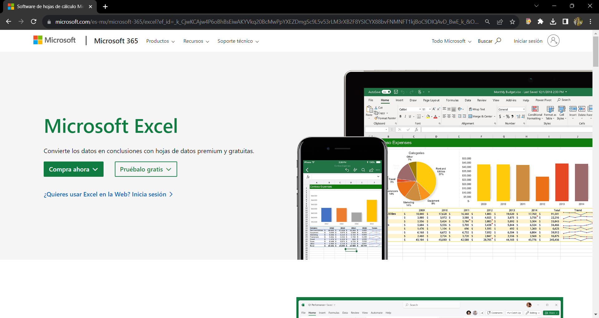  
<br>

2. Once it is installed, the first thing you'll see (after the initial configuration), is a screen like this:  
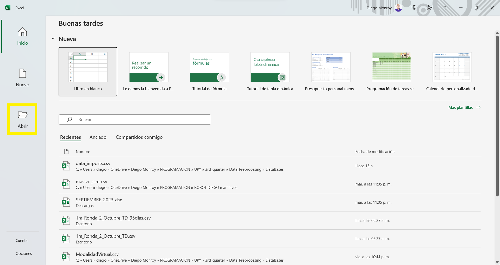
Then we need to click on "Abrir" or "Open".  
<br>

3. The next interface you'll see is something like the next one, where we need to click in "Examinar" to open a File Explorer.  
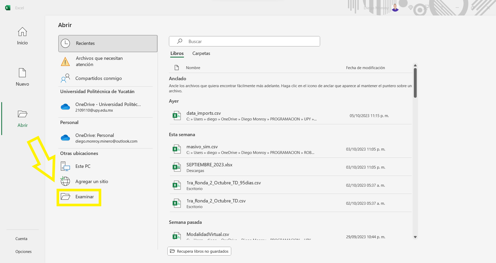  
<br>

4. Once we navigate to the directory where our CSV File is located, we select it.
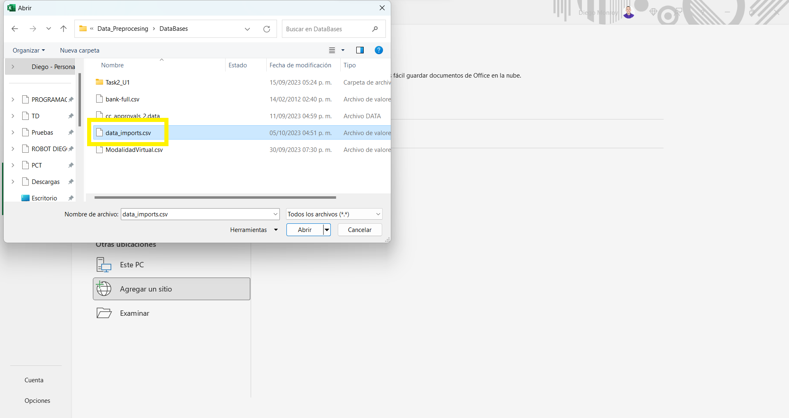  
<br>

5. Finally, our information will be displayed and imported to Excel.
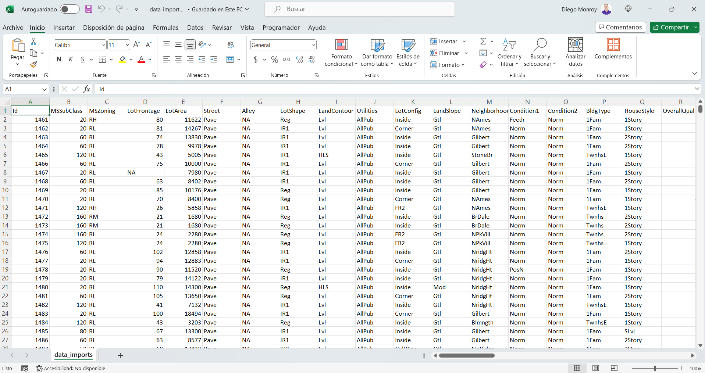  
<br>


### JS (JavaScript) - Node JS
1. We need to download Node JS. We can download ir from [Node JS | Download](https://nodejs.org/es):
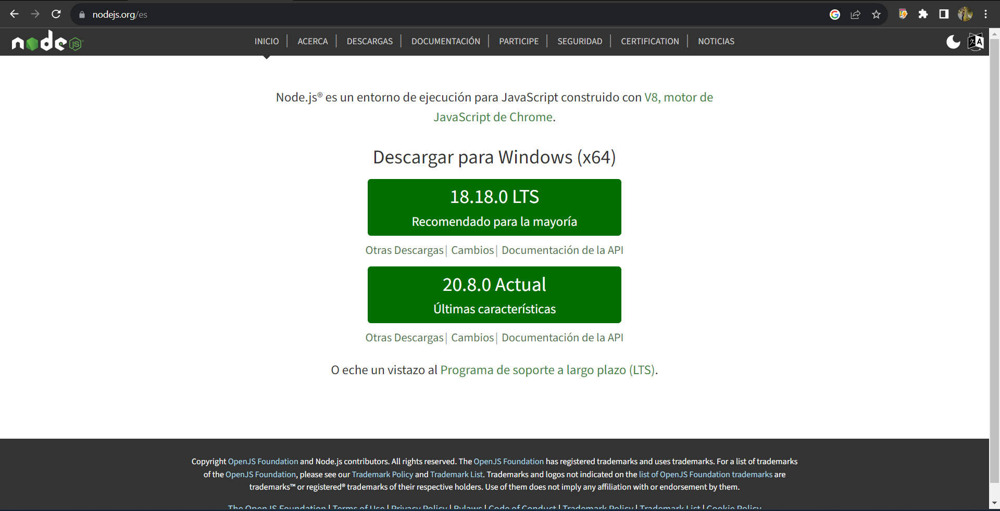  
<br>

2. Once it is downloaded and installed, we need to open a terminal and navigate to the location of our project. With the following lines we initialize a project and we install the library 'csv-parse':  
``` cmd
<!-- Initializing a project -->
npm init -y

<!-- Installing 'csv-parse' -->
npm install csv-parse
```  
<br>

3. Once we install the required library, we can run the next script to make a Data Import:
``` js
// Sentence to print in console the header of the activity
console.log("First Data Import in JavaScript!\n\n") 

// Declaration of libraries
const { readFileSync } = require('fs') 
const { parse } = require('csv-parse/sync')

// Declaration of a variable with the data of our CSV File
const fileContent = parse(
    readFileSync('data_imports.csv','UTF-8'),{
    columns: true,
    cast: (value, context) => {
        if (context.column === 'Id') return Number(value)
        return value
        }
    }
)

// Sentence to print in console the data of our CSV File
console.log(fileContent)
```  
<br>

4. To run our script, we can do it from console:
``` cmd
node main.js
```  
<br>

5. The output of the script will be something like this:
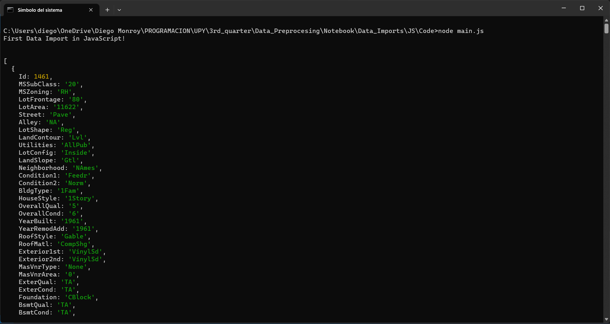  
<br>


### PowerBi
1. We need to access to [Power Bi](https://powerbi.microsoft.com/es-mx/landing/free-account/?ef_id=_k_CjwKCAjw4P6oBhBsEiwAKYVkq8K6jcRKoTCI7a1Tk0wwfqI1ipRcbg2y5Nqe8MqiEXde2VmY1Ruk_RoCO7sQAvD_BwE_k_&OCID=AIDcmm2lib5waq_SEM__k_CjwKCAjw4P6oBhBsEiwAKYVkq8K6jcRKoTCI7a1Tk0wwfqI1ipRcbg2y5Nqe8MqiEXde2VmY1Ruk_RoCO7sQAvD_BwE_k_&gclid=CjwKCAjw4P6oBhBsEiwAKYVkq8K6jcRKoTCI7a1Tk0wwfqI1ipRcbg2y5Nqe8MqiEXde2VmY1Ruk_RoCO7sQAvD_BwE) and start a free trial:
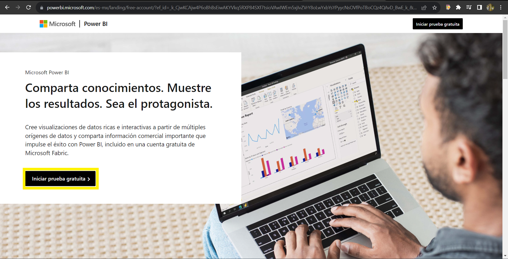  
<br>

2. Then we create an account:
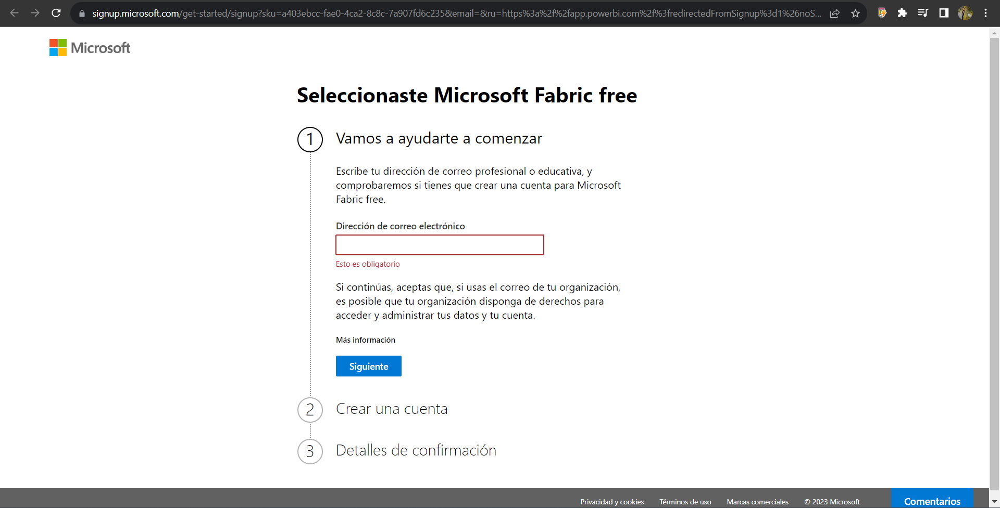  
<br>

3. Once we create an account, we will be redirected to their landing page:
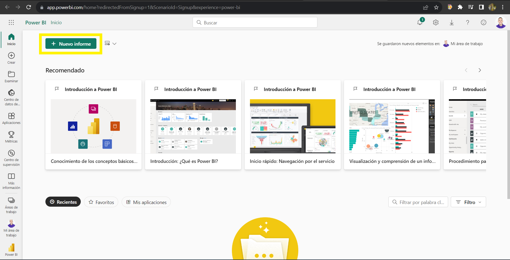
Then, we click on "Nuevo informe" to import data  
<br>

4. When clicked, we need to select the first option in order to paste the data from our CSV File:
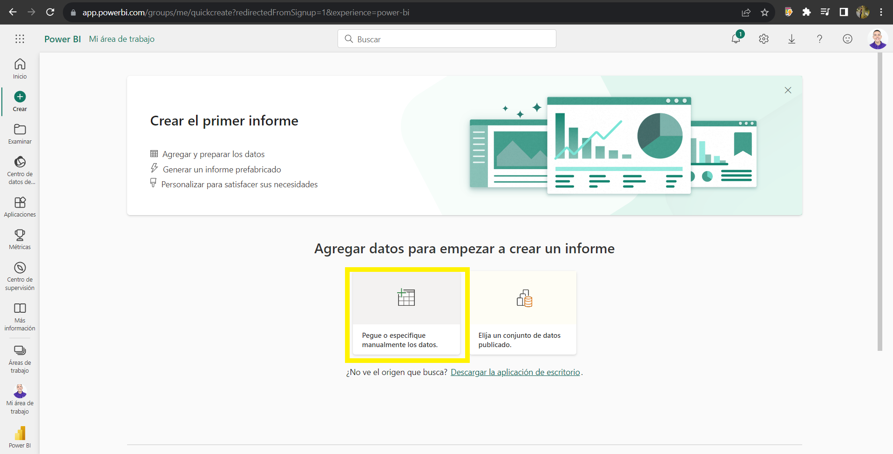  
<br>

5. Here we paste our data from our CSV and then we click on "Crear informe de manera automatica" to generate our data import.
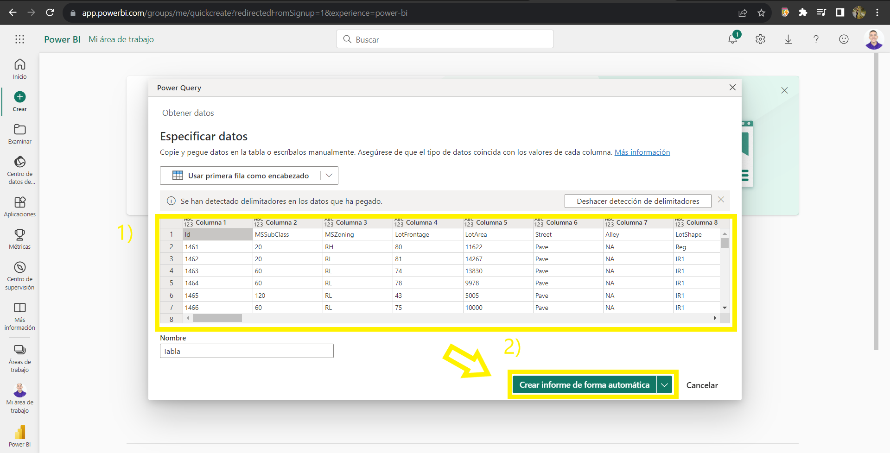  
<br>

6. There you go, now we will have a dashboard in Power Bi.
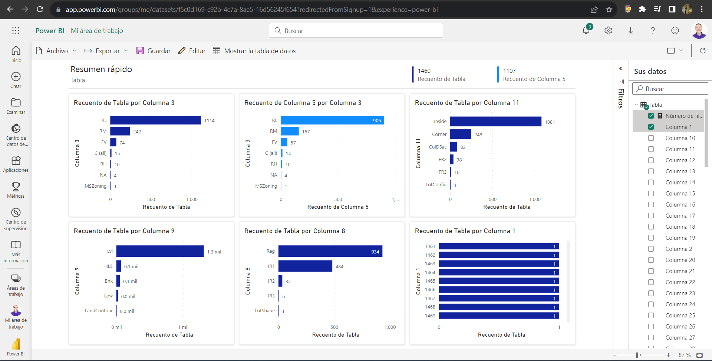  
<br>


### R - R Project
1. First, we need to [download R Project](https://cran.r-project.org/bin/windows/base/):  
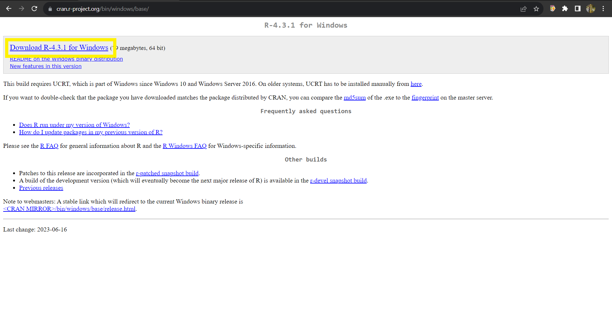  
<br>

2. Once installed, we can run the next script to make a Data Import:
``` R
# Declare a variable with the data of our CSV File
data <- read.csv("../../../../DataBases/data_imports.csv", header = TRUE, sep = ",")
# Print in console the CSV File
data
```  
<br>

3. The output should look something like this:
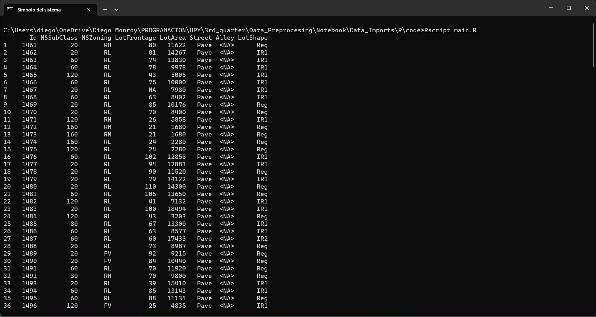  
<br>


### SQL - MySQL Workbench
1. First, we need to download MySQL Workbench from [MySQL Community Downloads](https://dev.mysql.com/downloads/workbench/):  
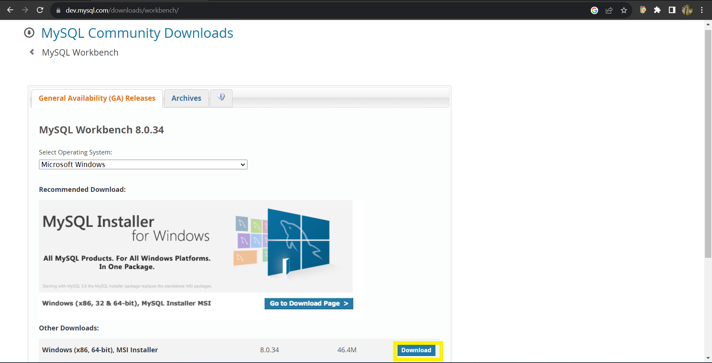  
<br>

2. After the installation, we need to select our connection:  
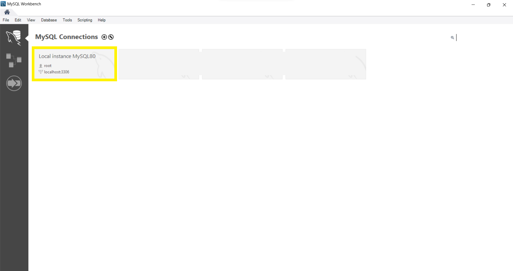  
<br>

3. Right after we select our connection, we need to create a schema/database.   
To create a database, we click on the first icon and it automatically open the menu to configure our schema.  
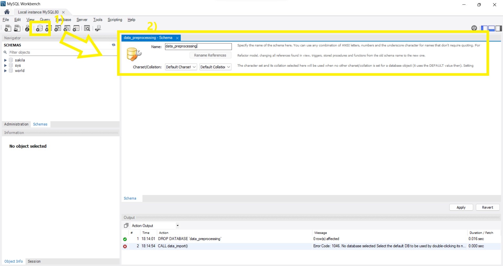  
<br>

4. Once our schema appears in 'Navigator' menu, we select it with the secondary button of our mouse to select 'Table Data Import Wizard' option.  
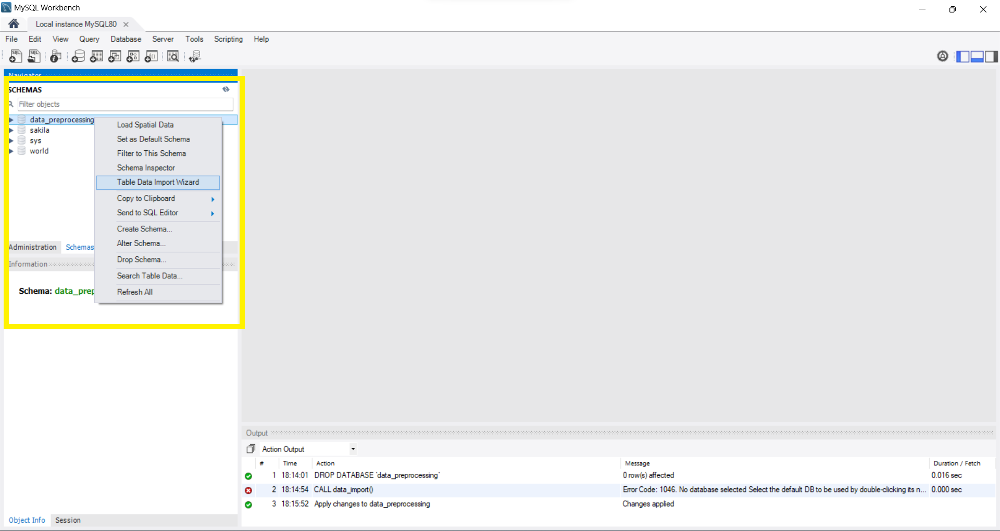  
<br>

5. Then it will open another window to select our CSV File:
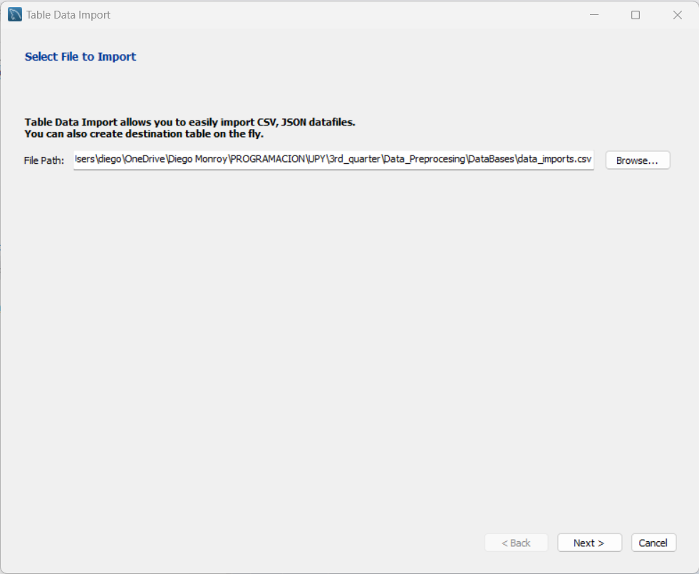  
<br>

6. When our CSV File is selected, in another window we can configure our table:
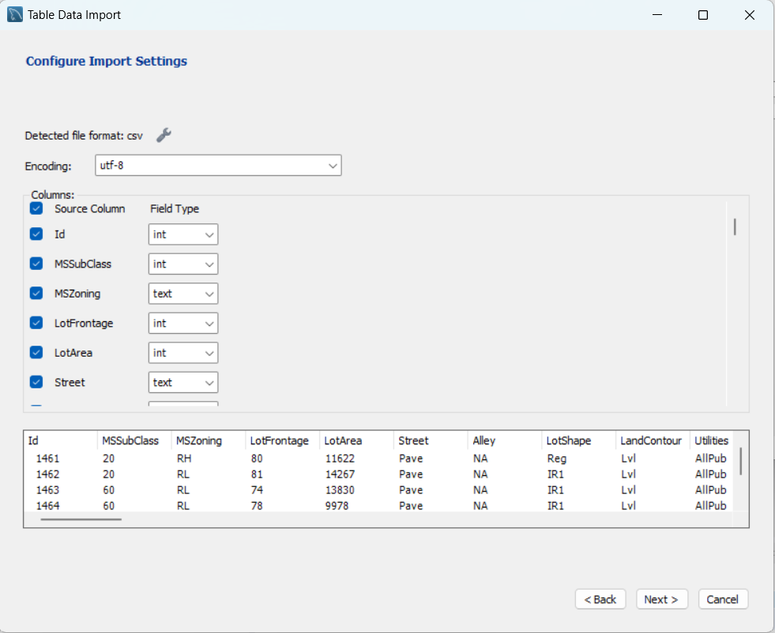  
<br>

7. Once we finish with the configuration of our table, the data import will be done.  
To confirm it, we should be able to se the table we created in 'Navigator' Menu. If we select the table, it will show us a list with the column name and the data type of the table:
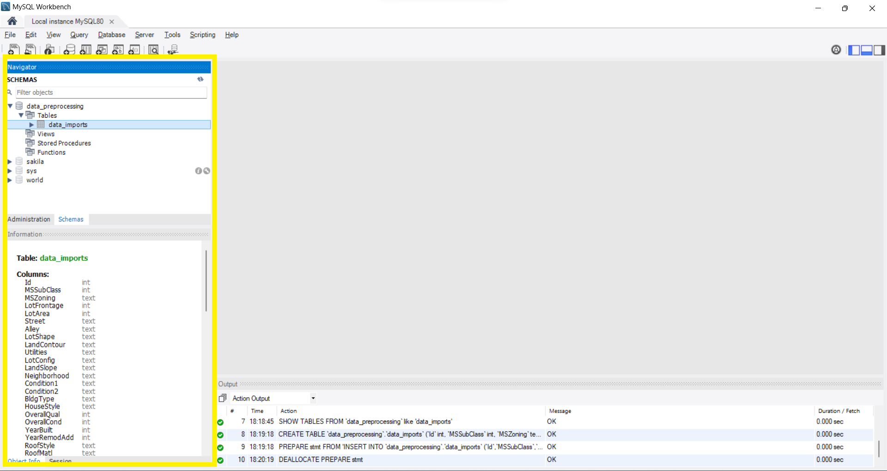  
<br>


## Made By
- Diego Monroy Minero